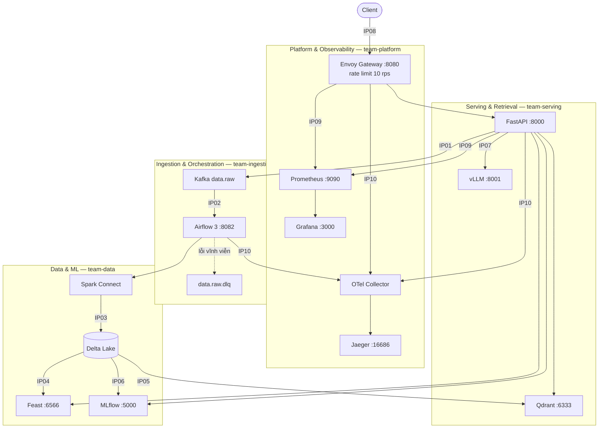

# Kiến trúc và người phụ trách — Day 28 Track 2

Sơ đồ trực quan: [`images/lab28-architecture-overview.png`](images/lab28-architecture-overview.png).
Tài liệu này bổ sung phần **ownership** mà sơ đồ ảnh không thể hiện.

## Luồng dữ liệu và 10 boundary

## Bảng phụ trách

| IP | Boundary | Owner | Health signal | Evidence |
|---|---|---|---|---|
| IP01 | HTTP → Kafka | team-ingestion | broker reachable, `data.raw` tồn tại | `ip01-kafka-consume.json` |
| IP02 | Kafka → Airflow | team-ingestion | `/api/v2/monitor/health` | `ip02-airflow-run.json` |
| IP03 | Spark → Delta | team-data | `history()` đọc được, version tăng | `ip03-delta-history.json` |
| IP04 | Delta → Feast | team-data | `/health` 200 + get-online-features | `ip04-feast-online.json` |
| IP05 | Delta → Qdrant | team-serving | `/readyz` 200, point count > 0 | `ip05-qdrant-search.json` |
| IP06 | Eval → MLflow | team-data | alias `champion` resolve được | `ip06-mlflow-release.json` |
| IP07 | Prompt → vLLM | team-serving | `/version` là vLLM, metric `vllm:` | `ip07-vllm-identity.json` |
| IP08 | Client → Envoy | team-platform | admin `/ready`, route `/healthz` | `ip08-gateway.json` |
| IP09 | → Prometheus/Grafana | team-platform | mọi job `up` | `ip09-*.json` |
| IP10 | → OTLP | team-platform | trace query được theo ID | `ip10-trace.json` |

Bài này làm **cá nhân** — một người kiêm cả 5 vai; cột owner giữ nguyên theo
`contracts/integration-matrix.yaml` để đối chiếu.

## Ba trạng thái sẵn sàng

| Trạng thái | Điều kiện | Hành vi gateway |
|---|---|---|
| `ready` | mọi probe pass | nhận traffic |
| `degraded` | chỉ probe **không bắt buộc** fail | vẫn nhận traffic, câu trả lời gắn cờ `degraded` |
| `not_ready` | có ít nhất một probe **bắt buộc** fail | rút pod khỏi rotation (503) |

Logic ở `integration_tasks.readiness_status`; phân loại mandatory/optional ở
`readiness.py`. Phân biệt `/health` (liveness, không chạm dependency) với
`/ready` (readiness, kiểm tra dependency) là điều kiện để restart loop và
rotation không đánh nhau: nếu liveness cũng kiểm tra dependency thì một Feast
chết sẽ làm Kubernetes restart API vô hạn thay vì chỉ ngừng gửi traffic.
