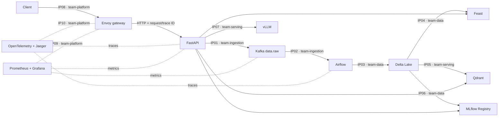

# Architecture and ownership

| Owner | Integration points | Responsibility |
|---|---|---|
| `team-ingestion` | IP01–IP02 | HTTP events, Kafka contracts, Airflow, retry and DLQ/replay |
| `team-data` | IP03–IP04, IP06 | Delta MERGE/time travel, Feast materialization, MLflow release/rollback |
| `team-serving` | IP05, IP07 | Hybrid retrieval, deterministic vector IDs, grounded inference and fallback |
| `team-platform` | IP08–IP10 | Envoy policy, readiness, metrics/dashboards, OTLP traces and GitOps |
| `team-presenter` | all | Evidence index, incident narrative, demo order and Q&A |

This submission was completed individually. The role split above is retained so an
incident can still be routed to the correct system boundary during the demo.
