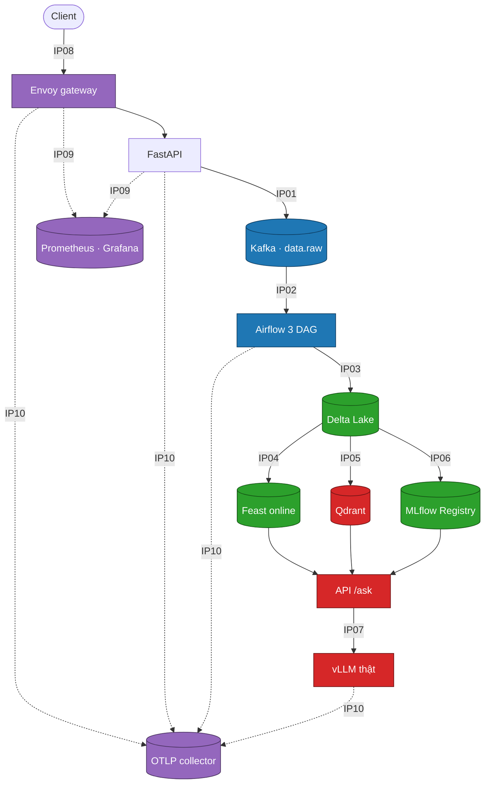

# Architecture & ownership map

Bổ sung cho [`docs/images/lab28-architecture-overview.svg`](images/lab28-architecture-overview.svg).
Diagram gốc vẽ đủ mười boundary nhưng không ghi ai sở hữu boundary nào; trang này
bù phần đó, lấy trực tiếp từ trường `owner` và `layer` trong
[`contracts/integration-matrix.yaml`](../contracts/integration-matrix.yaml).

Làm cá nhân, nên cả năm vai do một người đảm nhiệm. Giữ nguyên tên vai vẫn có ích:
khi một boundary hỏng, câu hỏi đầu tiên của facilitator là "vai nào sở hữu chỗ
này" — và bảng phân loại lỗi trong [`docs/facilitator-guide.md`](facilitator-guide.md)
cũng chẩn đoán theo owner chứ không theo tên service.

## Luồng request và owner từng chặng

Nét liền là đường dữ liệu, nét đứt là đường telemetry. Màu theo vai sở hữu:
xanh dương `team-ingestion`, xanh lá `team-data`, đỏ `team-serving`,
tím `team-platform`.

## Bảng ownership

| IP | Boundary | Layer | Owner | Readiness check |
|---|---|---|---|---|
| IP01 | HTTP → Kafka | L2 Data | `team-ingestion` | `reliability.kafka_topics` |
| IP02 | Kafka → Airflow | L2 Data | `team-ingestion` | `reliability.airflow_pipeline` |
| IP03 | Airflow/Spark → Delta | L2 Data | `team-data` | — |
| IP04 | Delta → Feast | L3 ML | `team-data` | — |
| IP05 | Delta → Qdrant | L2 Data | `team-serving` | — |
| IP06 | Eval → MLflow Registry | L3 ML | `team-data` | — |
| IP07 | RAG → vLLM | L1 Compute | `team-serving` | `reliability.inference_endpoint` |
| IP08 | Client → Envoy | L1 Compute | `team-platform` | `security.gateway_policy` |
| IP09 | → Prometheus/Grafana | L4 Ops | `team-platform` | `observability.metrics_and_alerts` |
| IP10 | → OTLP trace | L4 Ops | `team-platform` | `observability.trace_continuity` |

`team-presenter` không sở hữu boundary nào; vai này sở hữu evidence pack, kịch bản
demo và phần tường thuật sự cố.

Phân bố: `team-data` giữ nhiều boundary nhất (IP03, IP04, IP06) và cả ba đều nằm
trên đường ghi dữ liệu, nên một lỗi schema ở đây lan ra xa nhất. `team-platform`
giữ IP08–IP10, tức toàn bộ phần quan sát được của hệ thống — mất vai này thì các
vai còn lại mất khả năng chẩn đoán.

## Đường đi của bốn hàm đã hoàn thiện

Bốn hàm trong [`src/lab28_platform/integration_tasks.py`](../src/lab28_platform/integration_tasks.py)
không nằm gọn trong một vai:

| Hàm | Gọi bởi | Boundary | Vai |
|---|---|---|---|
| `event_headers` | `event_bus.py` | IP01, IP10 | `team-ingestion` + `team-platform` |
| `dedupe_latest` | `delta_store.py` | IP03 | `team-data` |
| `feast_online_request` | `feature_store.py` | IP04 | `team-data` |
| `readiness_status` | `readiness.py` | IP07, IP08 | `team-serving` + `team-platform` |

`event_headers` là ví dụ rõ nhất của boundary hai chủ: `idempotency-key` phục vụ
replay (`team-ingestion`), `traceparent` phục vụ trace continuity
(`team-platform`). Một hàm ba dòng nhưng hỏng thì gãy hai IP thuộc hai vai khác
nhau — đó là lý do nó có test riêng thay vì được coi là chi tiết nội bộ của
producer.
